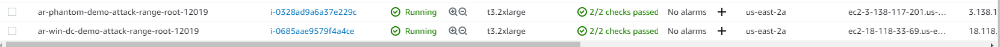
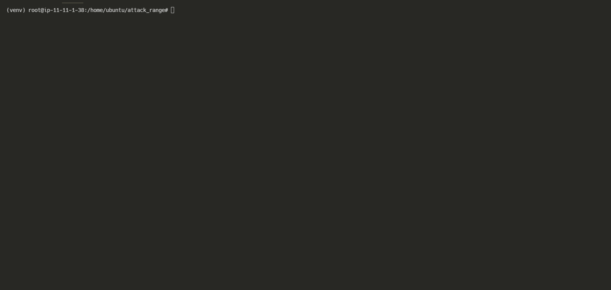
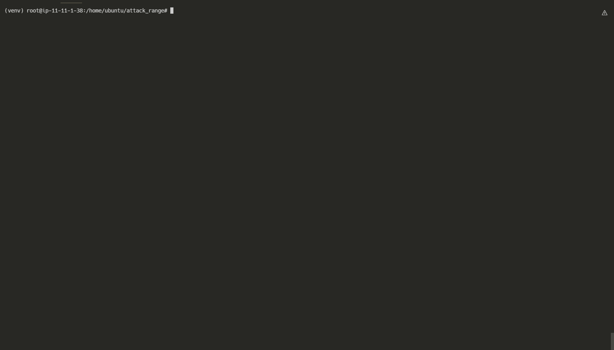

    <h1 align="center">Sophos ISE Project</h1>
    

    

<!-- logo -->
 

    
    <h3 align="center">Sophos ISE Project</h3>
    

        Sophos Inside Sales Engineer demo project to jumpstart ISE and SE demo environments and scenario data.
    

<!-- table of contents -->

    
Table of Contents

        <ol>
            <li><a href="#about-the-project">About The Project</a>                
            <li><a href="#proof-of-concept">Proof of concept</a> 
            <li><a href="#Demo-AWS">Demo</a>
        </ol>

<!-- about the project -->
## About the Project

This project was initiated by Jeramy Kopacko, with the help of Christopher Glick and Ralph Brynard, with the intent to create a <strong>Sophos Sales Experience</strong>, whereby Sophos customers can deploy an ephemeral development environment to actively test competing solutions with Sophos Central Intercept X Advanced. 

The goal of the project is two-fold:

<ul>
    <li> To utilize IaC and DevOps concepts and technologies to build ephemeral environments for generating threat case data to equip the Sales Engineering teams to effectively and efficiently demonstrate Sophos solutions with real-world automated simulations. 
    <li> To perform head-to-head real-world tests with independent third-party attack emulation tools (Atomic Red Team, MITRE Caldera, etc...) to collect real-world competitive intelligence data. The secondary goal may also include providing a platform for customers to run head-to-head tests against Sophos and other third-party vendors to compare the performance of competitive solutions with Sophos solutions.
</ul>

## Proof of Concept

Splunk has developed the open-source project, <a href="https://github.com/splunk/attack_range">Attack Range</a>, as a "detection development platform." This project addresses three main challenges in detection engineering:
<ol>
    <li> Quickly and consistently build a small ephemeral lab environment that is as close as possible to a production environment.
    <li> The attack range performs attack simulation using different engines, including Atmoc Red Team and Caldera, as well as an ad-hoc Kali Linux machine for additional testing.
    <li> The project integrates seamlessly into an CI/CD pipeline to automate detection rule testing, or alternatively, generation of detection data for threat case creation.
</ol>

The tool utilizes terraform, and ansible to provision the environment, and natively supports AWS and Azure. A local version of the project utilizes Vagrant and VirtualBox for local environment automation.

The Sophos project would ultimately retain the same functionality as the Splunk attack_range projects. However, support for Public Cloud and local attack range builds should be available from the same project. For local builds, support for VMWare Workstation, VirtualBox, VSphere, and Hyper-V should be available with Terraform still serving at the provisioner for those platforms as well. However, Vagrant support may be preferrable as we can build pre-defined vagrant boxes which could be utilized as well. To-that-end, implementing packer for custom image/template builds which can be utilized by Terraform as well would also be ideal.

## Demo - AWS 

<h3 align="left">Configuring and Building</h2>

First configure the environment to execute the simulated attack data.

With the configuration set, we can now build the environment. The Splunk project is limited to Windows Server AMI's in AWS at the moment, however, it is possible to upload a custom Windows 10 AMI and utilize this image in the AWS build environment. 

The project will build the AWS environment and allow us to being running our attacks on the instances. 

Once the environment is built, we can view the list of hosts to start executing our attack simulations.

<h3 align="left">Attack Simulation</h3>

With the environment built, we'll initiate a simulated attack using the MITRE ATT&CK Tactic, T1589.001

<h3 align="left">Data Analysis</h3>

The simulated attack triggers detections from Central Intercept X Advanced, and populates the events in the Threat Analysis Center

